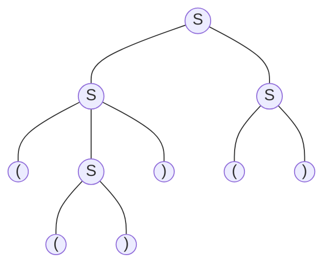

# Practice Session

## Context Free Languages

- A language class larger than the class of regular languages
- Generated by context free grammars
- Can you provide a Type-3 grammar to produce palindromes from $Σ = \{a,b\}$
- Can you provide a Type-3 grammar to produce parenthesized expressions from $Σ = \{(,a,b,)\}$
- Think about HTML tags. Nested scopes in programming languages. If-then-else structures.

#### CFG for $\{ 0^n1^n\ |\ n ≥ 1 \}$

$\langle S \rangle ::= 0 \langle S \rangle 1\ |\ 01$

#### CFG for well-formed parentheses

$\langle S \rangle ::= \langle S \rangle \langle S \rangle \ |\ (\langle S \rangle)\ |\ ()$

#### CFG for $\{ 0^m1^n\ |\ m ≥ n \}$

$\langle S \rangle ::= 0 \langle S \rangle 1\ |\ \langle A \rangle$  
$\langle A \rangle ::= 0 \langle A \rangle \ |\ 0$

#### CFG for Boolean arithmetic expressions

$\langle E \rangle ::= \langle E \rangle + \langle E \rangle \ |\ \langle E \rangle × \langle E \rangle\ |\ (\langle E \rangle)\ |\ \langle F \rangle$  
$\langle F \rangle ::= x\langle F \rangle \ |\ y\langle F \rangle \ |\ 1\langle F \rangle$  
$\langle F \rangle ::= x\ |\ y\ |\ 0\ |\ 1$

## Leftmost Derivations

$E ⇒^{\ast} x×(xy+10)$ ($⇒^{\ast}$ denotes zero or more derivation steps)

$\langle E \rangle$  
$⇒ \langle E \rangle × \langle E \rangle$  
$⇒ \langle F \rangle × \langle E \rangle$  
$⇒ x × \langle E \rangle$  
$⇒ x × (\langle E \rangle)$  
$⇒ x × (\langle E \rangle + \langle E \rangle)$  
$⇒ x × (\langle F \rangle + \langle E \rangle)$  
$⇒ x × (x\langle F \rangle + \langle E \rangle)$  
$⇒ x × (xy + \langle E \rangle)$  
$⇒ x × (xy + \langle F \rangle)$  
$⇒ x × (xy + 1\langle F \rangle)$  
$⇒ x × (xy + 10)$  

## Rightmost Derivations

$E ⇒^{\ast} x×(xy+10)$ ($⇒^{\ast}$ denotes zero or more derivation steps)

$\langle E \rangle$  
$⇒ \langle E \rangle × \langle E \rangle$  
$⇒ \langle E \rangle × (\langle E \rangle)$  
$⇒ \langle E \rangle × (\langle E \rangle + \langle E \rangle)$  
$⇒ \langle E \rangle × (\langle E \rangle + \langle F \rangle)$  
$⇒ \langle E \rangle × (\langle E \rangle + 1\langle F \rangle)$  
$⇒ \langle E \rangle × (\langle E \rangle + 10)$  
$⇒ \langle E \rangle × (\langle F \rangle + 10)$  
$⇒ \langle E \rangle × (x\langle F \rangle + 10)$  
$⇒ \langle E \rangle × (xy + 10)$  
$⇒ \langle F \rangle × (xy + 10)$  
$⇒ x × (xy + 10)$  

## Sentential Forms

- For a grammar G, with start symbol S, any string α such that $S⇒^{\ast}α$ is called a sentential form.
- If α contains only terminals then α is called a sentence in L(G).
- If α contains one or more non-terminals, it is just a sentential form.
- A *left-sentential form* occurs during the leftmost derivation of a sentence
- A *right-sentential form* occurs during the rightmost derivation of a sentence

$\langle E \rangle$  
$⇒ \langle E \rangle × \langle E \rangle$  
$⇒ \langle E \rangle × (\langle E \rangle)$  
$⇒ \langle E \rangle × (\langle E \rangle + \langle E \rangle)$  
$⇒ \langle E \rangle × (\langle F \rangle + \langle E \rangle)$  
$⇒ \langle E \rangle × (1 + \langle E \rangle)$  
$\langle E \rangle × (1 + \langle E \rangle)$ is a sentential form but it is neither right nor left

$\langle E \rangle$  
$⇒ \langle E \rangle × \langle E \rangle$  
$⇒ \langle F \rangle × \langle E \rangle$  
$⇒ x × (\langle F \rangle + \langle E \rangle)$  
$x × (\langle F \rangle + \langle E \rangle)$ is a left sentential form

$\langle E \rangle$  
$⇒ \langle E \rangle × \langle E \rangle$  
$⇒ \langle E \rangle × (\langle E \rangle)$  
$⇒ \langle E \rangle × (\langle E \rangle + \langle E \rangle)$  
$\langle E \rangle × (\langle E \rangle + \langle E \rangle)$ is a right sentential form

## Parsing and Parse Trees

We can represent a particular derivation by a CFG using a parse tree, where
- Each internal node is labeled by a non-terminal symbol
- Each leaf is labeled by terminal symbol
- Root is labeled by the start symbol

$\langle S \rangle ::= \langle S \rangle \langle S \rangle \ |\ (\langle S \rangle)\ |\ ()$  
Parse tree for $ω = (())()$

