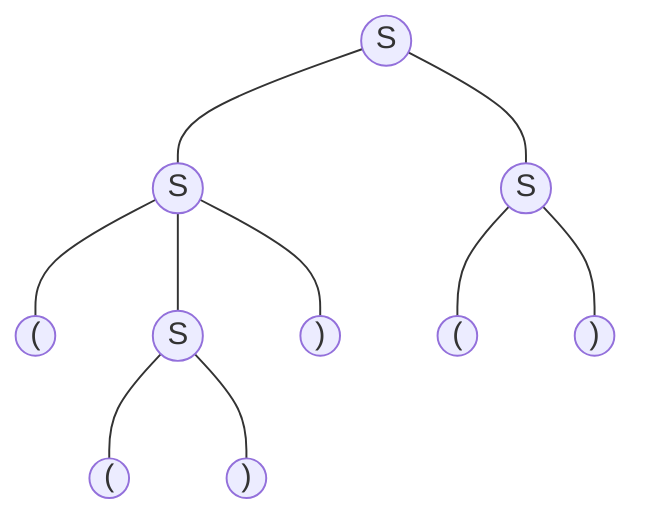

# Practice Session

## Context Free Languages

- A language class larger than the class of regular languages
- Generated by context free grammars
- Can you provide a Type-3 grammar to produce palindromes from $Σ = \{a,b\}$
- Can you provide a Type-3 grammar to produce parenthesized expressions from $Σ = \{(,a,b,)\}$
- Think about HTML tags. Nested scopes in programming languages. If-then-else structures.

#### CFG for $\{ 0^n1^n\ |\ n ≥ 1 \}$

$\langle S \rangle ::= 0 \langle S \rangle 1\ |\ 01$

#### CFG for well-formed parentheses

$\langle S \rangle ::= \langle S \rangle \langle S \rangle\ |\ (\langle S \rangle)\ |\ ()$

#### CFG for $\{ 0^m1^n\ |\ m ≥ n \}$

$\langle S \rangle ::= 0 \langle S \rangle 1\ |\ \langle A \rangle$  
$\langle A \rangle ::= 0 \langle A \rangle\ |\ 0$

#### CFG for Boolean arithmetic expressions

$\langle E \rangle ::= \langle E \rangle + \langle E \rangle\ |\ \langle E \rangle × \langle E \rangle\ |\ (\langle E \rangle)\ |\ \langle F \rangle$  
$\langle F \rangle ::= x\langle F \rangle\ |\ y\langle F \rangle\ |\ 1\langle F \rangle$  
$\langle F \rangle ::= x\ |\ y\ |\ 0\ |\ 1$


## Leftmost Derivations

$E ⇒^{\ast} x×(xy+10)$ ($⇒^{\ast}$ denotes zero or more derivation steps)

$\langle E \rangle$  
$⇒ \langle E \rangle × \langle E \rangle$  
$⇒ \langle F \rangle × \langle E \rangle$  
$⇒ x × \langle E \rangle$  
$⇒ x × (\langle E \rangle)$  
$⇒ x × (\langle E \rangle + \langle E \rangle)$  
$⇒ x × (\langle F \rangle + \langle E \rangle)$  
$⇒ x × (x\langle F \rangle + \langle E \rangle)$  
$⇒ x × (xy + \langle E \rangle)$  
$⇒ x × (xy + \langle F \rangle)$  
$⇒ x × (xy + 1\langle F \rangle)$  
$⇒ x × (xy + 10)$  

## Rightmost Derivations

$E ⇒^{\ast} x×(xy+10)$

$\langle E \rangle$  
$⇒ \langle E \rangle × \langle E \rangle$  
$⇒ \langle E \rangle × (\langle E \rangle)$  
$⇒ \langle E \rangle × (\langle E \rangle + \langle E \rangle)$  
$⇒ \langle E \rangle × (\langle E \rangle + \langle F \rangle)$  
$⇒ \langle E \rangle × (\langle E \rangle + 1\langle F \rangle)$  
$⇒ \langle E \rangle × (\langle E \rangle + 10)$  
$⇒ \langle E \rangle × (\langle F \rangle + 10)$  
$⇒ \langle E \rangle × (x\langle F \rangle + 10)$  
$⇒ \langle E \rangle × (xy + 10)$  
$⇒ \langle F \rangle × (xy + 10)$  
$⇒ x × (xy + 10)$  

## Sentential Forms

- For a grammar G, with start symbol S, any string α such that $S⇒^{\ast}α$ is called a sentential form.
- If α contains only terminals then α is called a sentence in L(G).
- If α contains one or more non-terminals, it is just a sentential form.
- A *left-sentential form* occurs during the leftmost derivation of a sentence
- A *right-sentential form* occurs during the rightmost derivation of a sentence

$\langle E \rangle$  
$⇒ \langle E \rangle × \langle E \rangle$  
$⇒ \langle E \rangle × (\langle E \rangle)$  
$⇒ \langle E \rangle × (\langle E \rangle + \langle E \rangle)$  
$⇒ \langle E \rangle × (\langle F \rangle + \langle E \rangle)$  
$⇒ \langle E \rangle × (1 + \langle E \rangle)$  
$\langle E \rangle × (1 + \langle E \rangle)$ is a sentential form but it is neither right nor left

$\langle E \rangle$  
$⇒ \langle E \rangle × \langle E \rangle$  
$⇒ \langle F \rangle × \langle E \rangle$  
$⇒ x × (\langle F \rangle + \langle E \rangle)$  
$x × (\langle F \rangle + \langle E \rangle)$ is a left sentential form

$\langle E \rangle$  
$⇒ \langle E \rangle × \langle E \rangle$  
$⇒ \langle E \rangle × (\langle E \rangle)$  
$⇒ \langle E \rangle × (\langle E \rangle + \langle E \rangle)$  
$\langle E \rangle × (\langle E \rangle + \langle E \rangle)$ is a right sentential form


# Context Free Grammars, Parsing and Ambiguous Grammars

## Parsing and Parse Trees

- Parsing, syntax analysis, or syntactic analysis is the process of analyzing a string of symbols, conforming to the rules of a formal grammar.
- A parser is a software component that takes input data and builds a data structure–often some kind of parse tree, abstract syntax tree, giving a structural representation of the input while checking for correct syntax.
- Parser repeatedly matches left/right hand-side of a production against a substring in the current left/right-sentential form.
- We can represent a particular derivation by a CFG using a parse tree, where
  - Each internal node is labeled by a non-terminal symbol
  - Each leaf is labeled by terminal symbol
  - Root is labeled by the start symbol

$\langle S \rangle ::= \langle S \rangle \langle S \rangle\ |\ (\langle S \rangle)\ |\ ()$  
Parse tree for $ω = (())()$



## Recap: Example CFG

#### CFG for Boolean arithmetic expressions

$\langle E \rangle ::= \langle E \rangle + \langle E \rangle\ |\ \langle E \rangle * \langle E \rangle\ |\ (\langle E \rangle)\ |\ \langle F \rangle$  
$\langle F \rangle ::= x\langle F \rangle\ |\ y\langle F \rangle\ |\ 1\langle F \rangle$  
$\langle F \rangle ::= x\ |\ y\ |\ 0\ |\ 1$

Please note that × (i.e., multiplication symbol) has been replaced with * to avoid any
confusion between the symbol × and the terminal x, based on the feedback I received from
you yesterday.

## Parsing and Parse Trees- Example#1

$E ⇒^{\ast} x*(xy+10)$

## Parsing and Parse Trees- Example#1- Leftmost Derivation

```mermaid
graph TD
    11(E)
    21(E)
    22(#42;)
    23(E)
    31(F)
    32("(")
    33(E)
    34(")")
    41(x)
    42(E)
    43(#43;)
    44(E)
    51(F)
    52(F)
    61(x)
    62(F)
    63(1)
    64(F)
    71(y)
    72(0)

    11 --- 21
    11 --- 22
    11 --- 23
    21 --- 31
    23 --- 32
    23 --- 33
    23 --- 34
    31 --- 41
    33 --- 42
    33 --- 43
    33 --- 44
    42 --- 51
    44 --- 52
    51 --- 61
    51 --- 62
    52 --- 63
    52 --- 64
    62 --- 71
    64 --- 72

    classDef default fill:none,stroke:none;
```

$\langle E \rangle$  
$⇒ \langle E \rangle * \langle E \rangle$  
$⇒ \langle F \rangle * \langle E \rangle$  
$⇒ x * \langle E \rangle$  
$⇒ x * (\langle E \rangle)$  
$⇒ x * (\langle E \rangle + \langle E \rangle)$  
$⇒ x * (\langle F \rangle + \langle E \rangle)$  
$⇒ x * (x\langle F \rangle + \langle E \rangle)$  
$⇒ x * (xy + \langle E \rangle)$  
$⇒ x * (xy + \langle F \rangle)$  
$⇒ x * (xy + 1\langle F \rangle)$  
$⇒ x * (xy + 10)$  

## Parsing and Parse Trees- Example#1- Rightmost Derivation

```mermaid
graph TD
    11(E)
    21(E)
    22(#42;)
    23(E)
    31(F)
    32("(")
    33(E)
    34(")")
    41(x)
    42(E)
    43(#43;)
    44(E)
    51(F)
    52(F)
    61(x)
    62(F)
    63(1)
    64(F)
    71(y)
    72(0)

    11 --- 21
    11 --- 22
    11 --- 23
    21 --- 31
    23 --- 32
    23 --- 33
    23 --- 34
    31 --- 41
    33 --- 42
    33 --- 43
    33 --- 44
    42 --- 51
    44 --- 52
    51 --- 61
    51 --- 62
    52 --- 63
    52 --- 64
    62 --- 71
    64 --- 72

    classDef default fill:none,stroke:none;
```

$\langle E \rangle$  
$⇒ \langle E \rangle * \langle E \rangle$  
$⇒ \langle E \rangle * (\langle E \rangle)$  
$⇒ \langle E \rangle * (\langle E \rangle + \langle E \rangle)$  
$⇒ \langle E \rangle * (\langle E \rangle + \langle F \rangle)$  
$⇒ \langle E \rangle * (\langle E \rangle + 1\langle F \rangle)$  
$⇒ \langle E \rangle * (\langle E \rangle + 10)$  
$⇒ \langle E \rangle * (\langle F \rangle + 10)$  
$⇒ \langle E \rangle * (x\langle F \rangle + 10)$  
$⇒ \langle E \rangle * (xy + 10)$  
$⇒ \langle F \rangle * (xy + 10)$  
$⇒ x × (xy + 10)$  

## Parsing and Parse Trees- Example#1- Notes

- To every left (right) most derivation there exists a unique parse tree (and vice versa).
- What is a Parse Tree? A parse tree shows the structure of how a string is derived from the grammar.  
It shows what was produced, not in what order.
- What is a Derivation? A derivation is the step-by-step process of expanding nonterminals.  
Leftmost derivation always expand the leftmost nonterminal first.  
Rightmost derivation always expand the rightmost nonterminal first.

## Question

Given a grammar, is it possible that every (left/right) derivation for a string (i.e., sentence) is
unique?  
Let’s consider the following string:  

$x + y * 0$

## Parsing and Parse Trees- Example#2- Leftmost Derivation(#1)

$E ⇒^{\ast} x + y * 0$

```mermaid
graph TD
    11(E)
    21(E)
    22(#42;)
    23(E)
    31(E)
    32(#43;)
    33(E)
    34(F)
    41(F)
    42(F)
    43(0)
    51(x)
    52(y)

    11 --- 21
    11 --- 22
    11 --- 23
    21 --- 31
    21 --- 32
    21 --- 33
    23 --- 34
    31 --- 41
    33 --- 42
    34 --- 43
    41 --- 51
    42 --- 52

    classDef default fill:none,stroke:none;
```

$\langle E \rangle$  
$⇒ \langle E \rangle * \langle E \rangle$  
$⇒ \langle E \rangle + \langle E \rangle * \langle E \rangle$  
$⇒ \langle F \rangle + \langle E \rangle * \langle E \rangle$  
$⇒ x + \langle E \rangle * \langle E \rangle$  
$⇒ x + \langle F \rangle * \langle E \rangle$  
$⇒ x + y * \langle E \rangle$  
$⇒ x + y * \langle F \rangle$  
$⇒ x + y * 0$  

## Parsing and Parse Trees- Example#2- Leftmost Derivation(#2)

$E ⇒^{\ast} x + y * 0$

```mermaid
graph TD
    11(E)
    21(E)
    22(#43;)
    23(E)
    31(F)
    32(E)
    33(#42;)
    34(E)
    41(x)
    42(F)
    43(F)
    51(y)
    52(0)

    11 --- 21
    11 --- 22
    11 --- 23
    21 --- 31
    23 --- 32
    23 --- 33
    23 --- 34
    31 --- 41
    32 --- 42
    34 --- 43
    42 --- 51
    43 --- 52

    classDef default fill:none,stroke:none;
```

$\langle E \rangle$  
$⇒ \langle E \rangle + \langle E \rangle$  
$⇒ \langle F \rangle + \langle E \rangle$  
$⇒ x + \langle E \rangle$  
$⇒ x + \langle E \rangle * \langle E \rangle$  
$⇒ x + \langle F \rangle * \langle E \rangle$  
$⇒ x + y * \langle E \rangle$  
$⇒ x + y * \langle F \rangle$  
$⇒ x + y * 0$  

## Parsing and Parse Trees- Example#2- Notes

- If a grammar is ambiguous, it does not necessarily exhibit this ambiguity in every string it generates. A grammar is classified as ambiguous if there exists at least one string in the language for which more than one parse tree can be constructed. The remaining strings in the language may still have unique parse trees.
- For any given parse tree, the leftmost derivation and the rightmost derivation derived from that tree will, in general, differ in the order of their derivation steps. However, this difference does not constitute ambiguity, as both derivations correspond to the same unique parse tree and therefore represent the same structural interpretation of the string.

## Ambiguous Grammars

#### Definition

A context-free grammar G is said to be **ambiguous** if there exists at least one string w in the
language L(G) for which more than one distinct parse tree can be constructed.  
Equivalently, a grammar G is ambiguous if there exists at least one string $w ∈ L(G)$ that has
more than one **leftmost derivation**, or equivalently, more than one **rightmost derivation**.
If no such string exists — that is, if every string in L(G) has exactly one parse tree — then the
grammar is said to be **unambiguous**.

## Ambiguous Grammars (Another Example)

A CFG is said to be ambiguous if there exists a string which has more than one left-most/right-most derivation.

$\langle S \rangle ::= \langle S \rangle 1\ |\ 0 \langle S \rangle 1\ |\ 01$

$S ⇒^{\ast} 00111$

$\langle S \rangle$  
$⇒ 0 \langle S \rangle 1$  
$⇒ 0 \langle S \rangle 11$  
$⇒ 00111$  

$\langle S \rangle$  
$⇒ \langle S \rangle 1$  
$⇒ 0 \langle S \rangle 11$  
$⇒ 00111$  

Wait... isn’t our goal simply to decide whether w ∈ L(G)? So where did ambiguity suddenly
come from?

#### Why Ambiguity Matters

A grammar does more than recognize valid strings; it assigns them structure, and that structure determines meaning. If a string has two parse trees, it effectively has two interpretations.

Example: for the expression x + y * 0,
- Parse tree 1: (x + y) * 0 = 0
- Parse tree 2: x + (y * 0) = 0

Same string, two different results.

Note. In this example, we assume standard arithmetic interpretation where + denotes addition, *(or ×) denotes multiplication, and the operands x, y, and 0 represent numerical values. Under this interpretation:
Parse tree 1: (x + y) * 0 = 0, because any number multiplied by 0 equals 0
Parse tree 2: x + (y * 0) = x, because y * 0 = 0, so we are left with x + 0 = x

#### Compilers Require Unambiguous Grammars

A compiler must generate one parse tree to produce machine code. If the grammar is ambiguous, the compiler may choose the wrong tree, producing incorrect behavior that is difficult to debug. This is why programming languages use carefully designed unambiguous grammars.

#### Ambiguity Also Affects Natural Language

Ambiguity complicates language processing. For example, the sentence: “I saw the man with the telescope” has two possible meanings, and a machine must infer which one is intended. This illustrates why reliable natural language understanding is challenging.

## Removing Ambiguity in Grammars- Approach#1

It may be possible to remove ambiguity for some CFGs by rewriting the grammar and imposing rules and restrictions such as precedence.  
Let’s assume the precedence: $(),×,+$

#### Ambiguous grammar

$\langle S \rangle ::= \langle S \rangle + \langle S \rangle$  
$\langle S \rangle ::= \langle S \rangle × \langle S \rangle$  
$\langle S \rangle ::= (\langle S \rangle)$  
$\langle S \rangle ::= x\ |\ y\ |\ z\ |\ 0\ |\ 1$  

#### Unambiguous grammar

$\langle A \rangle ::= \langle A \rangle + \langle B \rangle\ | \ \langle B \rangle$  
$\langle B \rangle ::= \langle B \rangle × \langle C \rangle\ | \ \langle C \rangle$  
$\langle C \rangle ::= (\langle A \rangle) \ | \ \langle D \rangle$   
$\langle D \rangle ::= x\ |\ y\ |\ z\ |\ 0\ |\ 1$

## Removing Ambiguity in Grammars- Approach#2

Another example for the balanced parentheses grammar. This forces a right associative grammar (i.e., always to the right).

$S ⇒^{\ast} ()()()$

#### Ambiguous grammar

$\langle S \rangle ::= \langle S \rangle \langle S \rangle$  
$\langle S \rangle ::= (\langle S \rangle)$  
$\langle S \rangle ::= ()$  

Leftmost derivation #1:

$\langle S \rangle$  
$⇒ \langle S \rangle \langle S \rangle$  
$⇒ \langle S \rangle \langle S \rangle \langle S \rangle$  
$⇒ () \langle S \rangle \langle S \rangle$  
$⇒ ()() \langle S \rangle$  
$⇒ ()()()$  

Leftmost derivation #2:

$\langle S \rangle$  
$⇒ \langle S \rangle \langle S \rangle$  
$⇒ () \langle S \rangle$  
$⇒ () \langle S \rangle \langle S \rangle$  
$⇒ ()() \langle S \rangle$  
$⇒ ()()()$  

#### Unambiguous grammar

$\langle B \rangle ::= (\langle R \rangle \langle B \rangle\ |\ λ$  
$\langle R \rangle ::=\ )\ |\ (\langle R \rangle \langle R \rangle$  

Leftmost derivation:

$\langle B \rangle$  
$⇒ ( \langle R \rangle \langle B \rangle$  
$⇒ () \langle B \rangle$  
$⇒ ()( \langle R \rangle \langle B \rangle$  
$⇒ ()() \langle B \rangle$  
$⇒ ()()( \langle R \rangle \langle B \rangle$  
$⇒ ()()() \langle B \rangle$  
$⇒ ()()()$  

## Inherent Ambiguity

Sure, plenty of ambiguous grammars can be cleaned up: add some precedence, reshape the rules, and the ambiguity disappears. But sometimes ...

*If L is a context-free language, does there always exist an unambiguous grammar G with L(G) = L ?*

Surprisingly, the answer is **NO**.

For some languages, it may not be possible to remove ambiguity. A CFL is said to be inherently ambiguous if every CFG that describes it is ambiguous. Two classic examples are:

$L_1 = \{a^nb^nc^md^m\ |\ n,m ≥ 1 \} ∪ \{a^nb^mc^md^n\ |\ n,m ≥ 1 \}$

$L_2 = \{0^i1^j2^k\ |\ i = j ∨ j = k\}$

Example: Derivation of $a^nb^nc^nd^n$


## Ambiguous Languages

- A languages is said to be (inherently) ambiguous if there doesn’t exist any unambiguous grammars that can define the language.
- A context free language can be ambiguous.
- Regular grammars can be ambiguous but a regular language cannot be ambiguous.
- The problem of ambiguity checking for a context free grammar/language is undecidable
- The problem of checking for ambiguity is decidable for regular grammars.

## Parsers

The parser is often preceded by a separate lexical analyzer, which creates tokens from the sequence of input characters


## LL and LR Parsing

- A grammar where you can always figure out the production to use in a leftmost derivation by scanning the given string left-to-right and looking only at the next one symbol is called LL(1)
- LL(1): ”Leftmost derivation, left-to-right scan, one symbol of lookahead.” LL(1) grammars are never ambiguous.
- An LR parser reads input text from left to right without backing up and produces a rightmost derivation in reverse. It does a bottom-up parse–not a top-down LL parse.
- The name LR is often followed by a numeric qualifier, as LR(k).
- To avoid backtracking or guessing, the LR parser is allowed to peek ahead at k lookahead input symbols before deciding how to parse earlier symbols.
- ANTLR is an example to modern parser generators